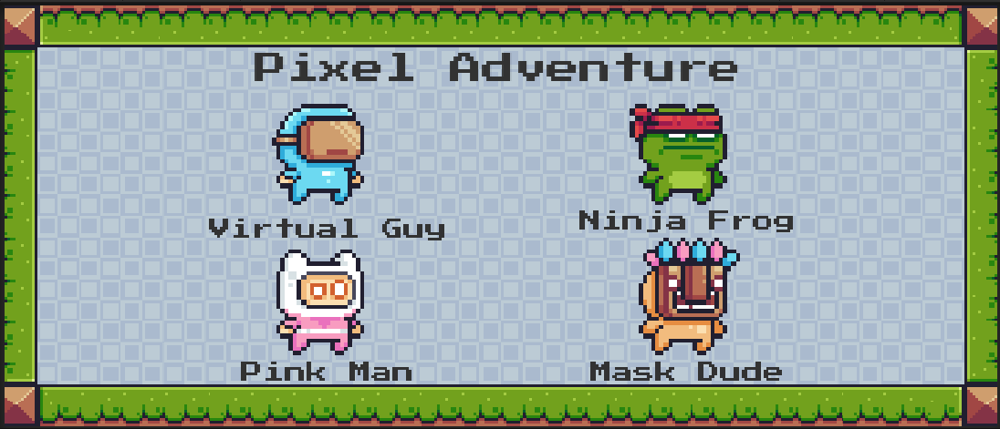
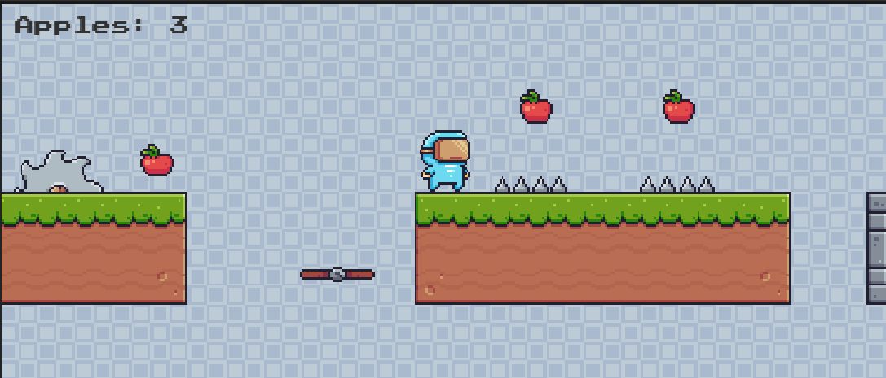
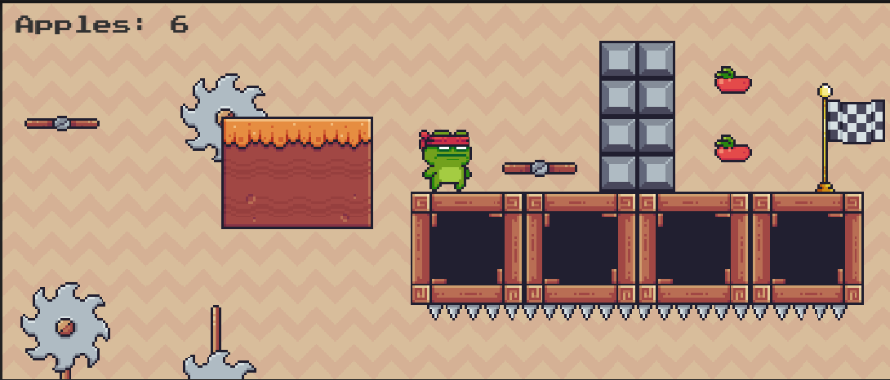

# PixelAdventure
- Created a 2D platformer style game using Unity engine and C# for scripting.
- Designed several game levels with different difficulty and look using various tilemap palletes.
- Developed a main manu scene with option for choosing one of 4 different players.}
- Implemented features like player movement, collecting items, moving platforms and moving traps with the addition of many animations and sound effects.

